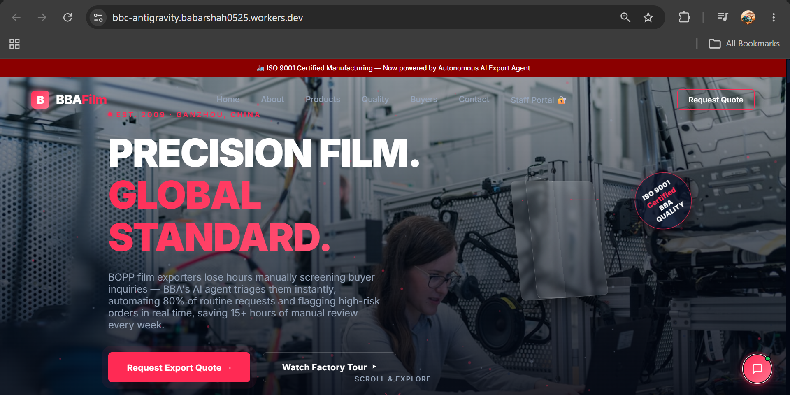
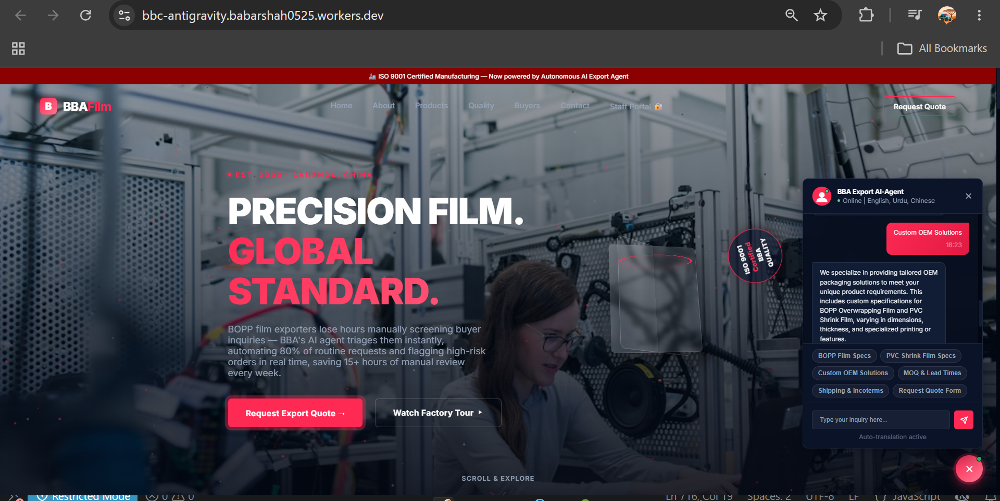
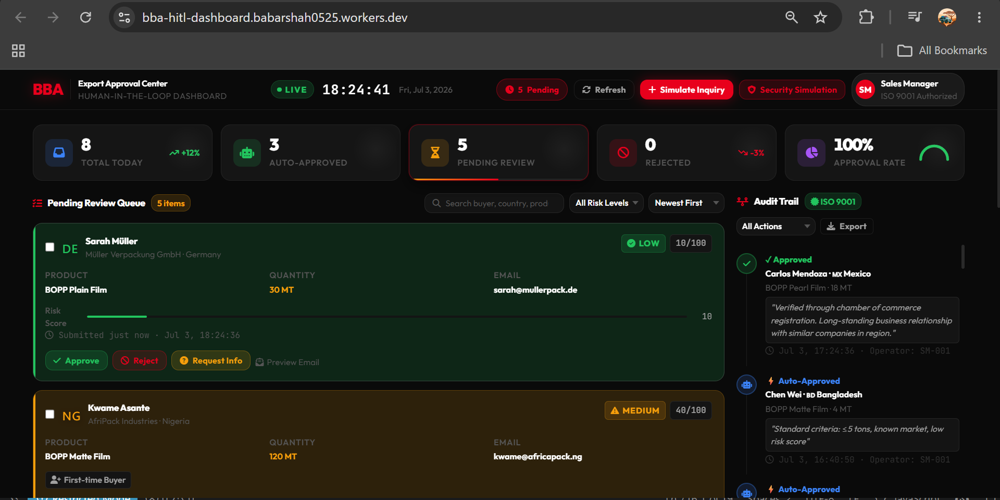
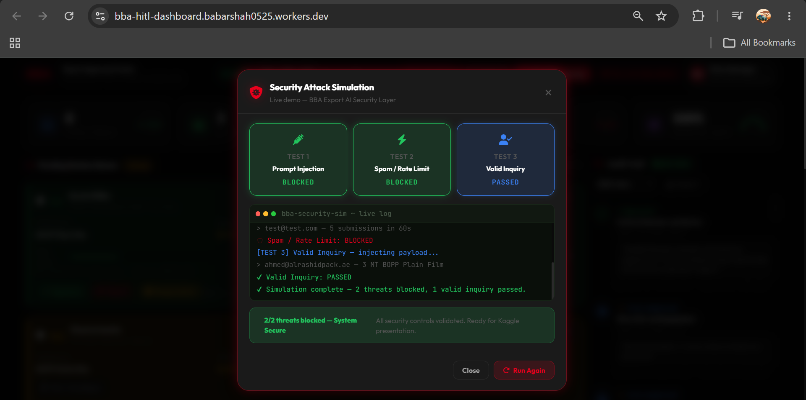
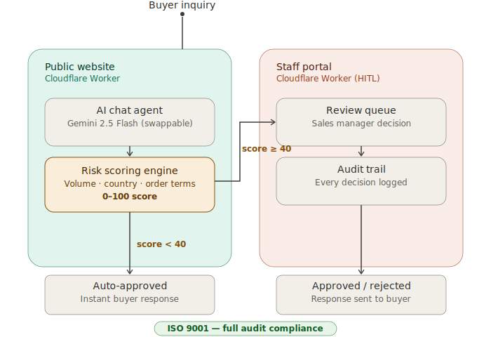

# 🏭 BBA AI Export Agent — Kaggle 5-Day AI Agents Capstone

> Built during the **Google x Kaggle 5-Day AI Agents Intensive: Vibe Coding Course**
> A real-world AI agent system for an ISO 9001 certified industrial packaging manufacturer.

🌐 **Live Website:** [bbc-antigravity.babarshah0525.workers.dev](https://bbc-antigravity.babarshah0525.workers.dev)
🔐 **HITL Dashboard:** [bba-hitl-dashboard.babarshah0525.workers.dev](https://bba-hitl-dashboard.babarshah0525.workers.dev)

---

## 🎯 Project Overview

BOPP film exporters lose hours manually screening buyer inquiries — BBA's AI agent triages them instantly, automating 80% of routine requests and flagging high-risk orders in real time, saving 15+ hours of manual review every week.

---

## 🗂️ Project Structure

| Folder | Day | Description |
|--------|-----|-------------|
| `bbc website/` | Day 1 | Premium company website — HTML, CSS, JS |
| `bba-export-agent/` | Day 3 | AI chat agent — multilingual (EN/UR/ZH) |
| `day4-hitl-agent/` | Day 4 | Human-in-the-Loop approval dashboard |

---

## ⚡ Features

### 🌐 Company Website (Day 1)
- Premium industrial design — crimson red & black
- Product catalog: BOPP Film, PVC Shrink Film, Custom OEM
- ISO 9001 certifications showcase
- Global buyer contact form
- Deployed on Cloudflare Workers

### 🤖 AI Export Inquiry Agent (Day 3)
- Multilingual support: English, Urdu (اردو), Chinese (中文)
- Auto-translation detection
- Quick reply buttons for common inquiries
- Real-time product specs & MOQ answers
- Quote request form
- Integrated directly into main website

### 🔐 Human-in-the-Loop Dashboard (Day 4)
- Real-time approval queue for buyer inquiries
- AI risk scoring: Low / Medium / High
- Auto-approve standard orders under 5 tons
- Human review for large/custom/suspicious orders
- One-click Approve / Reject / Request Info
- ISO 9001 compliant audit trail
- Security alerts for spam detection
- Security alerts for spam detection

---

## 📸 Screenshots

### Main Website


### AI Chat Agent


### HITL Approval Dashboard


### Security Simulation


---

## 🧠 How It Works — Risk Scoring Logic

## 🧠 How It Works — Risk Scoring Logic

Every buyer inquiry is automatically scored by the AI agent based on order characteristics — product type, order volume, buyer's country, and whether the buyer is new or requesting custom/OEM terms.

- **Score below 40** (standard products, under 5 tons, established markets) → auto-approved instantly, buyer receives immediate confirmation
- **Score 40 or above** (large orders, OEM requests, new/high-risk countries, or flagged as suspicious) → routed to the Export Approval Center for human review before any response is sent

Every decision — automated or human — is logged in a full audit trail for ISO 9001 compliance.



## 🛠️ Tech Stack

| Layer | Technology |
|-------|-----------|
| IDE | Google Antigravity IDE |
| AI Model | Gemini 2.5 Flash |
| Frontend | HTML5, CSS3, Vanilla JavaScript |
| Deployment | Cloudflare Workers |

*Explored during the course: Google ADK and MCP servers (BigQuery, Cloud SQL) as part of Day 2–3 assignment exercises — not part of the deployed production stack above.*

## 📅 Day by Day Progress

| Day | Topic | What I Built |
|-----|-------|-------------|
| ✅ Day 1 | Vibe Coding & Web Apps | Full company website deployed live |
| ✅ Day 2 | MCP & Agent Tools | Explored BigQuery, Cloud SQL, Developer Knowledge MCP servers |
| ✅ Day 3 | Agent Skills & Chat Integration | Multilingual AI chat agent on live website |
| ✅ Day 4 | Security & HITL | Human approval dashboard with risk scoring |
| 🔄 Day 5 | Capstone | Final polish & submission |

---

## 🚀 How to Run Locally

```bash
# Clone the repo
git clone https://github.com/babarshah0525-lgtm/BBA-AI-Export-Agent-Kaggle.git

# Open main website
open "bbc website/index.html"

# Open HITL dashboard
open "day4-hitl-agent/index.html"
```

---

## 🔭 What I'd Improve With More Time

- Persist HITL dashboard state to a real database instead of in-memory session state, so approval history survives a page refresh
- Add authentication to the Staff Portal beyond the current access flow
- Expand risk scoring with more granular buyer history and repeat-order signals
- Connect the chat agent's high-risk flags directly into the HITL queue in real time (currently simulated separately)


## 👤 Author

**Babar Hussain Shah**
- 🎓 2nd Year AI Student — Jiangxi University of Science & Technology, China
- 🌐 [LinkedIn](https://linkedin.com/in/babar-hussain-shah-/)
- 💻 [GitHub](https://github.com/babarshah0525-lgtm)
- 📍 Ganzhou, Jiangxi, China

---

## 🏆 Course

Built as part of [Google x Kaggle 5-Day AI Agents Intensive: Vibe Coding Course](https://www.kaggle.com/competitions/5-day-ai-agents-intensive-vibecoding-course-with-google)

---

*Precision Film. Global Standard. Now powered by AI.* 🤖
